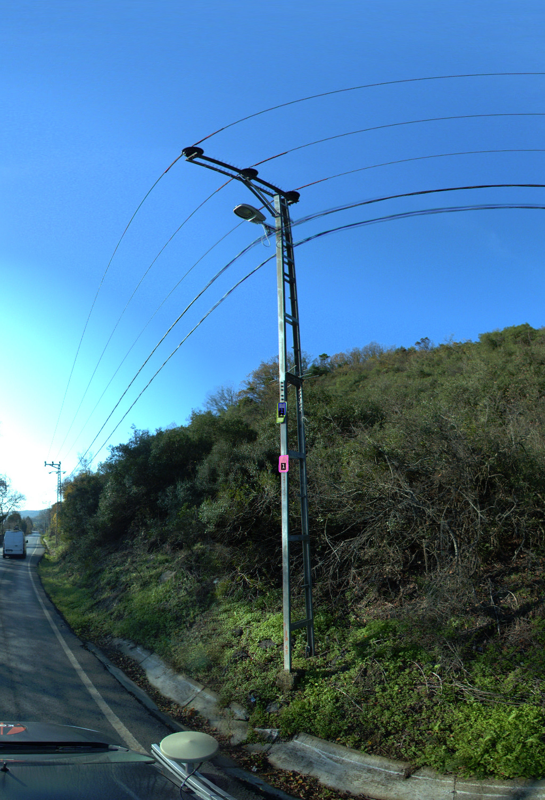

# Information plate_Shop Sign_Segmentation
 
This repository contains a trained object detection model using Detectron2 for detecting "Information plate" and "Shop Sign" classes. The trained model's final output has been included in the repository, and it has shown promising results in terms of accuracy.


## Usage

We provide a Colab notebook that demonstrates how to use the trained model for object detection. You can access the notebook using the following link:[ Open Colab Notebook](https://colab.research.google.com/drive/1OPu7e8u_PKbroPAIr3m_DGZ1K6yVMnww?usp=drive_link)

**In the Colab notebook:**

1. Run the provided code cells to set up the environment and load the trained model.
2. There's a prediction script cell where you can input the path to an image you want to test the model on:
   ```bash
   image = cv2.imread("image_path.jpg")
   predections = predictor(image)
3. Replace 'image_path.jpg' with the actual path of the image you want to test7
4. The predict function will take the image path as input and return the detected objects along with their instance segmentation.


## Example Result

Here is an example of the model's output:


